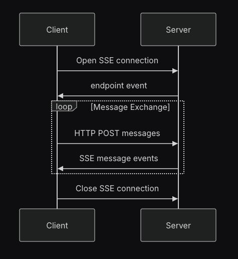

#  HTTP+SSE transport(SSE)
2025/04/23時点でMCPでは[HTTP+SSE transport](https://modelcontextprotocol.io/specification/2024-11-05/basic/transports#http-with-sse)ではなく[Streamable HTTP Transport](https://modelcontextprotocol.io/specification/2025-03-26/basic/transports#streamable-http)を使用することになっている。(HTTPによるStatelessなやりとりを前提としつつ、SSEによるStatefulなやりとりにも互換性あり)
しかし`python-sdk`のv1.6.0ではSSEしかサポートされておらず、[issue](https://github.com/modelcontextprotocol/python-sdk/issues/443)が上がっている状態。  
因みに[typescript-sdk](https://github.com/modelcontextprotocol/typescript-sdk?tab=readme-ov-file#streamable-http)では既にStreamable HTTP Transportがサポートされている。

### Update 2025/05/12
- 2025/05/09のMCP`python-sdk`v1.8.0で`Streamable HTTP`に対応した(これに伴い`langchain-mcp-adapters`も対応)
  - Streamable HTTP Transport(https://github.com/modelcontextprotocol/python-sdk#streamable-http-transport)
  - langchain-mcp-adapters(https://github.com/langchain-ai/langchain-mcp-adapters#streamable-http)
- `Streamable HTTP`は`SSE`とも[互換性がある](https://modelcontextprotocol.io/specification/2025-03-26/basic/transports#backwards-compatibility)

## 概要
- MCPサーバーを起動
- MCPサーバーのURL(`/sse`)を指定してMCPクライアントを起動
- MPCクライアントはHTTPリクエストによりSSEセッションを確立し、そのセッションを用いてツール実行等を行う(https://modelcontextprotocol.io/specification/2024-11-05/basic/transports#http-with-sse)
- HTTPで送信されるメッセージ(BODY)のフォーマットは[JSON-RPC](https://www.jsonrpc.org/)に準拠

### MCPサーバー
- `FastMCP`で`hello`というMCPサーバーを起動する
  - MCPサーバーには`hello_world`および`goodbye`というツールが含まれている(`@mcp.tool()`というデコレーターを設定)
    - ツールの機能はメッセージを生成して返すだけのシンプルなもの
- `SSE`を使用するために、起動時の`run()`メソッドの引数に`sse`を指定

### MCPクライアント
- MCPクライアントを起動する
  - MPCサーバーとのやり取りは非同期で実行
- 起動時にMCPサーバーのURLを指定することで`stream`(`MemoryObjectReceiveStream`)を取得しセッションを取得する
- MCPサーバーで定義されているツール一覧を取得する(`list_tools()`メソッド)
- MCPサーバーにリクエスト(使用したいツールと引数)を送信してツールを実行(`call_tool()`メソッド)

## 実行

MCPサーバーの起動
```bash
$ python mini_server.py
INFO:     Started server process [1919658]
INFO:     Waiting for application startup.
INFO:     Application startup complete.
INFO:     Uvicorn running on http://0.0.0.0:8080 (Press CTRL+C to quit)

(クライアントからのリクエストを受信)

INFO:     127.0.0.1:33914 - "GET /sse HTTP/1.1" 200 OK
INFO:     127.0.0.1:33924 - "POST /messages/?session_id=04a3b0bfd46f4e5fa7ac3f3dd59cd912 HTTP/1.1" 202 Accepted  # <-- リクエストパラメータにsession_idを含めることで同一セッションでやりとり
INFO:     127.0.0.1:33924 - "POST /messages/?session_id=04a3b0bfd46f4e5fa7ac3f3dd59cd912 HTTP/1.1" 202 Accepted
INFO:     127.0.0.1:33924 - "POST /messages/?session_id=04a3b0bfd46f4e5fa7ac3f3dd59cd912 HTTP/1.1" 202 Accepted
Processing request of type ListToolsRequest
INFO:     127.0.0.1:33924 - "POST /messages/?session_id=04a3b0bfd46f4e5fa7ac3f3dd59cd912 HTTP/1.1" 202 Accepted
Processing request of type CallToolRequest
```

MCPクライアントの実行 
```bash
$ python mini_client.py
tools: meta=None nextCursor=None tools=[Tool(name='hello_world', description='Say hello to someone', inputSchema={'properties': {'name': {'title': 'Name', 'type': 'string'}}, 'required': ['name'], 'title': 'hello_worldArguments', 'type': 'object'}), Tool(name='goodbye', description='Say goodbye to someone', inputSchema={'properties': {'name': {'title': 'Name', 'type': 'string'}}, 'required': ['name'], 'title': 'goodbyeArguments', 'type': 'object'})]
Tool result: [TextContent(type='text', text='Hello, MCP!', annotations=None)]
```

## (補足) SSEを使用したMCPクライアントとMCPサーバーの通信イメージ
- MCPクライアントとサーバー間でSSEセッションを確立する
- セッション確立後、クライアントからサーバーにPOSTでリクエストを送信し、そのレスポンスがSSEセッションに返される



- HTTP+SSE transport(https://modelcontextprotocol.io/specification/2024-11-05/basic/transports#http-with-sse)

### curlによるリクエスト
`curl`を用いてSSEセッションを確立し、ツール一覧を取得する`tools/list`を実行する。

最初に`/sse`というエンドポイントにGETリクエストを送信し、SSEセッションを確立する。
セッションIDが返されるので、その値を用いて別ターミナルから各種のリクエストを送信する。
リクエストの結果はSSEセッションに返される。
```bash
$ curl http://127.0.0.1:8080/sse

event: endpoint
data: /messages/?session_id=<SESSION_ID>  # <-- session_idを含むエンドポイントが返される

: ping - 2025-05-12 16:30:44.554519+00:00

: ping - 2025-05-12 16:30:59.556006+00:00
```


別ターミナルでセッションIDを環境変数に登録
```bash
$ export SESSION_ID=<SESSION_ID>
```

[Base Protocol Lifecycle](https://modelcontextprotocol.io/specification/2025-03-26/basic/lifecycle)に則り、
以下の順で`/messages/?session_id=<SESSION_ID>`にPOSTリクエストを送信する
-  `initialize`
-  `notifications/initialized`
-  `tools/list`

`initialize`
```bash
$ curl -X POST "http://127.0.0.1:8080/messages/?session_id=$SESSION_ID" \
  -H "Content-Type: application/json" \
  -H "Accept: application/json, text/event-stream" \
  -d '{
    "jsonrpc": "2.0",
    "id": 1,
    "method": "initialize",
    "params": {
      "protocolVersion": "v1",
      "capabilities": {},
      "clientInfo": {
        "name": "curl-client",
        "version": "0.0.1"
      }
    }
  }'
```

`notifications/initialized`
```bash
$ curl -X POST "http://127.0.0.1:8080/messages/?session_id=$SESSION_ID" \
  -H "Content-Type: application/json" \
  -H "Accept: application/json" \
  -d '{
    "jsonrpc": "2.0",
    "method": "notifications/initialized",
    "params": {}
  }'
```

`tools/list`
```bash
$ curl -X POST "http://127.0.0.1:8080/messages/?session_id=$SESSION_ID" \
  -H "Content-Type: application/json" \
  -H "Accept: application/json, text/event-stream" \
  -d '{
    "jsonrpc": "2.0",
    "id": 2,
    "method": "tools/list",
    "params": {}
  }'
```

最終的にSSEセッションには以下のような結果が返される。
```bash
$ curl http://127.0.0.1:8080/sse
event: endpoint
data: /messages/?session_id=<SESSION_ID>

: ping - 2025-05-12 16:05:03.622132+00:00

(initialize request実行結果)

event: message
data: {"jsonrpc":"2.0","id":1,"result":{"protocolVersion":"2024-11-05","capabilities":{"experimental":{},"prompts":{"listChanged":false},"resources":{"subscribe":false,"listChanged":false},"tools":{"listChanged":false}},"serverInfo":{"name":"hello","version":"1.8.0"}}}

: ping - 2025-05-12 16:05:33.625083+00:00

(tools/list request実行結果)

event: message
data: {"jsonrpc":"2.0","id":2,"result":{"tools":[{"name":"hello_world","description":"Say hello to someone","inputSchema":{"properties":{"name":{"title":"Name","type":"string"}},"required":["name"],"title":"hello_worldArguments","type":"object"}},{"name":"goodbye","description":"Say goodbye to someone","inputSchema":{"properties":{"name":{"title":"Name","type":"string"}},"required":["name"],"title":"goodbyeArguments","type":"object"}}]}}
```


## (参考)clientライブラリのメソッド定義

各種メソッドは`mcp/client/session.py`で定義されている。
- https://github.com/modelcontextprotocol/python-sdk/blob/main/src/mcp/client/session.py

```py
...
    async def call_tool(
        self, name: str, arguments: dict[str, Any] | None = None
    ) -> types.CallToolResult:
        """Send a tools/call request."""
        return await self.send_request(
            types.ClientRequest(
                types.CallToolRequest(
                    method="tools/call",
                    params=types.CallToolRequestParams(name=name, arguments=arguments),
                )
            ),
            types.CallToolResult,
        )

    async def list_prompts(self) -> types.ListPromptsResult:
        """Send a prompts/list request."""
        return await self.send_request(
            types.ClientRequest(
                types.ListPromptsRequest(
                    method="prompts/list",
                )
            ),
            types.ListPromptsResult,
        )
...
```