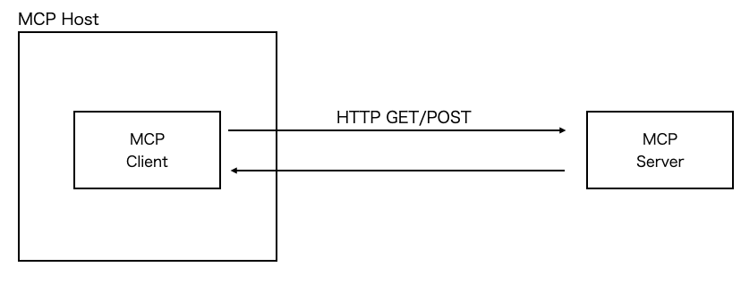

# Streamable HTTP
- `Streamable HTTP`(https://modelcontextprotocol.io/specification/2025-03-26/basic/transports#streamable-http)
  - 2025/03/26以降、MCPでは`SSE`に変わるTransportとして`Streamable HTTP`が推奨されている

- 2025/05/09のMCPの`python-sdk`v1.8.0で`Streamable HTTP`に対応した
  - Release v1.8.0(https://github.com/modelcontextprotocol/python-sdk/releases/tag/v1.8.0)
  - Streamable HTTP Support(https://github.com/modelcontextprotocol/python-sdk/issues/405)
- これに伴い`langchain-mcp-adapters`も対応
  - Release 0.0.11(https://github.com/langchain-ai/langchain-mcp-adapters/releases/tag/langchain-mcp-adapters%3D%3D0.0.11)
  - langchain-mcp-adapters(https://github.com/langchain-ai/langchain-mcp-adapters#streamable-http)


## 概要
- MCPサーバーを起動
- MCPサーバーのURL(`/mcp/`)を指定してMCPクライアントを起動
- MPCクライアントはHTTPリクエストによりMCPサーバーと通信する(https://modelcontextprotocol.io/specification/2025-03-26/basic/transports#streamable-http)
  - 基本的に`POST`メソッドのBODYで`JSON-RPC`をMCPサーバーに送信する
  - `GET`メソッドによりSSEセッションを確立することもできる
- HTTPで送信されるメッセージ(BODY)のフォーマットは[JSON-RPC](https://www.jsonrpc.org/)に準拠

### MCPサーバー
- `FastMCP`で`hello`というMCPサーバーを起動する
  - MCPサーバーには`hello_world`および`goodbye`というツールが含まれている(`@mcp.tool()`というデコレーターを設定)
    - ツールの機能はメッセージを生成して返すだけのシンプルなもの
- `Streamable HTTP`を使用するために、起動時の`run()`メソッドの引数に`streamable-http`を指定

### MCPクライアント
- MCPクライアントを起動する
  - MPCサーバーとのやり取りは非同期で実行
- 起動時にMCPサーバーのURLを指定することで`stream`(`MemoryObjectReceiveStream`)を取得しセッションを取得する
- MCPサーバーで定義されているツール一覧を取得する(`list_tools()`メソッド)
- MCPサーバーにリクエスト(使用したいツールと引数)を送信してツールを実行(`call_tool()`メソッド)


## 実行

MCPサーバーの起動
```bash
$ python ./mini_server.py
INFO:     Started server process [2446614]
INFO:     Waiting for application startup.
StreamableHTTP session manager started
INFO:     Application startup complete.
INFO:     Uvicorn running on http://0.0.0.0:8080 (Press CTRL+C to quit)

(クライアントからのリクエストを受信)

INFO:     127.0.0.1:44604 - "POST /mcp/ HTTP/1.1" 200 OK
INFO:     127.0.0.1:44604 - "POST /mcp/ HTTP/1.1" 202 Accepted
INFO:     127.0.0.1:44610 - "POST /mcp/ HTTP/1.1" 200 OK
Processing request of type ListToolsRequest
INFO:     127.0.0.1:44610 - "POST /mcp/ HTTP/1.1" 200 OK
Processing request of type CallToolRequest
```

MCPクライアントの実行 
```bash
$ python ./mini_client.py
tools: meta=None nextCursor=None tools=[Tool(name='hello_world', description='Say hello to someone', inputSchema={'properties': {'name': {'title': 'Name', 'type': 'string'}}, 'required': ['name'], 'title': 'hello_worldArguments', 'type': 'object'}, annotations=None), Tool(name='goodbye', description='Say goodbye to someone', inputSchema={'properties': {'name': {'title': 'Name', 'type': 'string'}}, 'required': ['name'], 'title': 'goodbyeArguments', 'type': 'object'}, annotations=None)]
Tool result: [TextContent(type='text', text='Hello, MCP!', annotations=None)]
```


## (補足) Streamable HTTPの通信イメージ
基本的には`POST`メソッドのBODYで`JSON-RPC`をMCPサーバーに送信する。  
`GET`メソッドによりSSEセッションを確立することもできる。



### curlによるリクエスト
`curl`を用いてMCPサーバーの`/mcp/`にPOSTリクエストを送信する。  

[Base Protocol Lifecycle](https://modelcontextprotocol.io/specification/2025-03-26/basic/lifecycle)に則り、
以下の順で`/mcp/`にPOSTリクエストを送信する。(`/mcp`にリクエストを送ると`/mcp/`にリダイレクトされる)
-  `initialize`
-  `notifications/initialized`
-  `tools/list`

`initialize`
```bash
$ curl -X POST "http://127.0.0.1:8080/mcp/" \
  -H "Content-Type: application/json" \
  -H "Accept: application/json, text/event-stream" \
  -d '{
    "jsonrpc": "2.0",
    "id": 1,
    "method": "initialize",
    "params": {
      "protocolVersion": "v1",
      "capabilities": {},
      "clientInfo": {
        "name": "curl-client",
        "version": "0.0.1"
      }
    }
  }'

event: message
data: {"jsonrpc":"2.0","id":1,"result":{"protocolVersion":"2024-11-05","capabilities":{"experimental":{},"prompts":{"listChanged":false},"resources":{"subscribe":false,"listChanged":false},"tools":{"listChanged":false}},"serverInfo":{"name":"hello","version":"1.8.0"}}}
```

`notifications/initialized`
```bash
$ curl -X POST "http://127.0.0.1:8080/mcp/" \
  -H "Content-Type: application/json" \
  -H "Accept: application/json, text/event-stream" \
  -d '{
    "jsonrpc": "2.0",
    "method": "notifications/initialized",
    "params": {}
  }'
```

`tools/list`
```bash
$ curl -X POST http://127.0.0.1:8080/mcp/ \
  -H "Content-Type: application/json" \
  -H "Accept: application/json, text/event-stream" \
  -d '{
    "jsonrpc": "2.0",
    "id": 1,
    "method": "tools/list",
    "params": {}
  }'


event: message
data: {"jsonrpc":"2.0","id":1,"result":{"tools":[{"name":"hello_world","description":"Say hello to someone","inputSchema":{"properties":{"name":{"title":"Name","type":"string"}},"required":["name"],"title":"hello_worldArguments","type":"object"}},{"name":"goodbye","description":"Say goodbye to someone","inputSchema":{"properties":{"name":{"title":"Name","type":"string"}},"required":["name"],"title":"goodbyeArguments","type":"object"}}]}}
```


SSEセッションの確立(おそらく従来のSSEとの互換性確保のため)
```bash
$ curl -X GET "http://127.0.0.1:8080/mcp/" \
  -H "Content-Type: application/json" \
  -H "Accept: application/json, text/event-stream"

 ping - 2025-05-12 15:10:04.701284+00:00

```