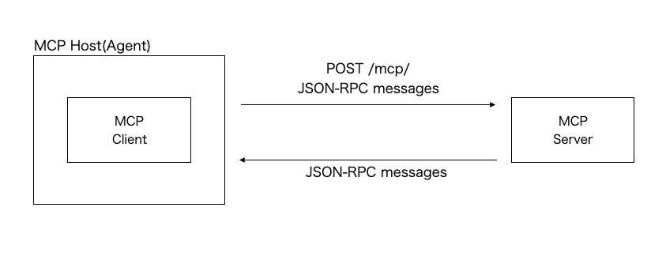

# MCP Streamable HTTP Transport
## 概要
- MCPサーバーを起動
- MCPサーバーのURLを指定してMCPクライアントを起動
- MPCクライアントはHTTPリクエストによりツールを実行(https://modelcontextprotocol.io/specification/2025-03-26/basic/transports#streamable-http)
- メッセージフォーマットは[JSON-RPC](https://www.jsonrpc.org/)に準拠

### MCPサーバー
- `FastMCP`で`hello`というMCPサーバーを起動する
  - MCPサーバーには`hello_world`および`goodbye`というツールが含まれている(`@mcp.tool()`というデコレーターを設定)
    - ツールの機能はメッセージを生成して返すだけのシンプルなもの
- `Streamable HTTP`を使用するために、起動時の`run()`メソッドの引数に`sse`を指定

### MCPクライアント
- MCPクライアントを起動する
  - MPCサーバーとのやり取りは非同期で実行
- 起動時にMCPサーバーのURLを指定することで`stream`(`MemoryObjectReceiveStream`)を取得しセッションを取得する
- MCPサーバーで定義されているツール一覧を取得する
- `call_tool()`メソッドを用いてMCPサーバーにリクエスト(使用したいツールと引数)を送信

## 実行

MCPサーバーの起動
```bash
$ python mini_server.py
INFO:     Started server process [1919658]
INFO:     Waiting for application startup.
INFO:     Application startup complete.
INFO:     Uvicorn running on http://0.0.0.0:8080 (Press CTRL+C to quit)

(クライアントからのリクエストを受信)

INFO:     127.0.0.1:33914 - "GET /sse HTTP/1.1" 200 OK
INFO:     127.0.0.1:33924 - "POST /messages/?session_id=04a3b0bfd46f4e5fa7ac3f3dd59cd912 HTTP/1.1" 202 Accepted
INFO:     127.0.0.1:33924 - "POST /messages/?session_id=04a3b0bfd46f4e5fa7ac3f3dd59cd912 HTTP/1.1" 202 Accepted
INFO:     127.0.0.1:33924 - "POST /messages/?session_id=04a3b0bfd46f4e5fa7ac3f3dd59cd912 HTTP/1.1" 202 Accepted
Processing request of type ListToolsRequest
INFO:     127.0.0.1:33924 - "POST /messages/?session_id=04a3b0bfd46f4e5fa7ac3f3dd59cd912 HTTP/1.1" 202 Accepted
Processing request of type CallToolRequest
```

MCPクライアントの実行 
```bash
$ python mini_client.py
tools: meta=None nextCursor=None tools=[Tool(name='hello_world', description='Say hello to someone', inputSchema={'properties': {'name': {'title': 'Name', 'type': 'string'}}, 'required': ['name'], 'title': 'hello_worldArguments', 'type': 'object'}), Tool(name='goodbye', description='Say goodbye to someone', inputSchema={'properties': {'name': {'title': 'Name', 'type': 'string'}}, 'required': ['name'], 'title': 'goodbyeArguments', 'type': 'object'})]
Tool result: [TextContent(type='text', text='Hello, MCP!', annotations=None)]
```

## (補足) stdioを使用したMCPクライアントとMCPサーバーの通信イメージ



`/sse`というエンドポイントにGETリクエストを送信するとセッションが確立される
セッション確立後にツール一覧取得(`tools/list`)やツール実行(`tools/call`)を行う
```bash
$ curl http://127.0.0.1:8080/sse
event: endpoint
data: /messages/?session_id=7e3e972c2fee49d19dd7deac884b02eb

: ping - 2025-04-19 16:30:44.554519+00:00

: ping - 2025-04-19 16:30:59.556006+00:00
```

各種メソッドは`mcp/client/session.py`で定義されている。
- https://github.com/modelcontextprotocol/python-sdk/blob/main/src/mcp/client/session.py

```py
...
    async def call_tool(
        self, name: str, arguments: dict[str, Any] | None = None
    ) -> types.CallToolResult:
        """Send a tools/call request."""
        return await self.send_request(
            types.ClientRequest(
                types.CallToolRequest(
                    method="tools/call",
                    params=types.CallToolRequestParams(name=name, arguments=arguments),
                )
            ),
            types.CallToolResult,
        )

    async def list_prompts(self) -> types.ListPromptsResult:
        """Send a prompts/list request."""
        return await self.send_request(
            types.ClientRequest(
                types.ListPromptsRequest(
                    method="prompts/list",
                )
            ),
            types.ListPromptsResult,
        )
...
```