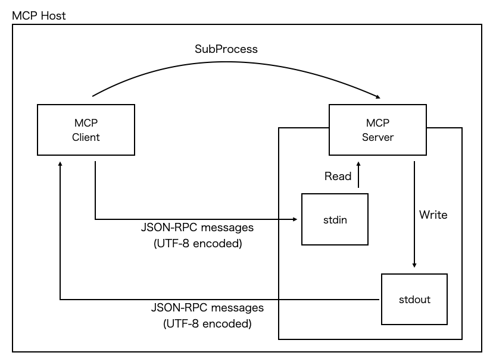

# MCP stdio Transport
## 概要
- MCPサーバーをサブプロセスとして起動(サーバーを起動するプログラム`mini_server.py`をクライアントを動かす前に実行)
- MCPクライアントを起動し、MCPサーバーの`stdio`を使って通信する
- MPCクライアントはMCPサーバーの`stdin`に書き込みを行い、MPCサーバーは`stdout`に結果を返す(https://modelcontextprotocol.io/specification/2025-03-26/basic/transports#stdio)
- メッセージフォーマットは[JSON-RPC](https://www.jsonrpc.org/)に準拠

### MCPサーバー
- `FastMCP`で`hello`というMCPサーバーを起動する
  - MCPサーバーには`hello_world`および`goodbye`というツールが含まれている(`@mcp.tool()`というデコレーターを設定)
    - ツールの機能はメッセージを生成して返すだけのシンプルなもの
- `stdio`を使用するために、起動時の`run()`メソッドの引数に`stdio`を指定

### MCPクライアント
- MCPクライアントを起動する
  - MPCサーバーとのやり取りは非同期で実行
- 起動時にMCPサーバーの`stdio`(`stdin`/`stdout`)を取得しセッションを取得する
- MCPサーバーで定義されているツール一覧を取得する
- `call_tool()`メソッドを用いてMCPサーバーにリクエスト(使用したいツールと引数)を送信

## 実行

```bash
$ python mini_client.py
Processing request of type ListToolsRequest
tools: meta=None nextCursor=None tools=[Tool(name='hello_world', description='Say hello to someone', inputSchema={'properties': {'name': {'title': 'Name', 'type': 'string'}}, 'required': ['name'], 'title': 'hello_worldArguments', 'type': 'object'}), Tool(name='goodbye', description='Say goodbye to someone', inputSchema={'properties': {'name': {'title': 'Name', 'type': 'string'}}, 'required': ['name'], 'title': 'goodbyeArguments', 'type': 'object'})]
Processing request of type CallToolRequest
Tool result: [TextContent(type='text', text='Hello, MCP!', annotations=None)]
```


## (補足) stdioを使用したMCPクライアントとMCPサーバーの通信イメージ



```bash
$ ps auxf
...
ubuntu-+ 1922061  6.7  0.1  59660 48580 pts/37   S+   00:51   0:00              \_ .../bin/python mini_client.py
ubuntu-+ 1922272  6.8  0.1 208412 48688 pts/37   Sl+  00:51   0:00                  \_ python ./mini_server.py  # <= MCPサーバーはMCPクライアントのサブプロセスとして起動
...

$ ls -la /proc/1922061/fd  # MCPクライアントプロセス(mini_client.py)のファイルディスクリプタ
total 0
dr-x------ 2 ubuntu-user ubuntu-user  9 Apr 20 00:54 .
dr-xr-xr-x 9 ubuntu-user ubuntu-user  0 Apr 20 00:52 ..
lrwx------ 1 ubuntu-user ubuntu-user 64 Apr 20 00:55 0 -> /dev/pts/37        # 0：標準入力（stdin）
lrwx------ 1 ubuntu-user ubuntu-user 64 Apr 20 00:55 1 -> /dev/pts/37        # 1：標準出力（stdout）
lrwx------ 1 ubuntu-user ubuntu-user 64 Apr 20 00:55 2 -> /dev/pts/37        # 2：標準エラー（stderr）
lrwx------ 1 ubuntu-user ubuntu-user 64 Apr 20 00:55 3 -> 'anon_inode:[eventpoll]'
lrwx------ 1 ubuntu-user ubuntu-user 64 Apr 20 00:55 4 -> 'socket:[138693240]'
lrwx------ 1 ubuntu-user ubuntu-user 64 Apr 20 00:55 5 -> 'socket:[138693241]'
lrwx------ 1 ubuntu-user ubuntu-user 64 Apr 20 00:55 6 -> 'anon_inode:[pidfd]'
l-wx------ 1 ubuntu-user ubuntu-user 64 Apr 20 00:55 7 -> 'pipe:[138693242]'  # <= MCPサーバーのstdin(MCPサーバーはここからメッセージを読み取る)
lr-x------ 1 ubuntu-user ubuntu-user 64 Apr 20 00:55 8 -> 'pipe:[138693243]'  # <= MCPサーバーのstdout(MCPサーバーはここにメッセージを書き込む)

$ ls -la /proc/1922272/fd  # MCPサーバープロセス(mini_server.py)のファイルディスクリプタ
total 0
dr-x------ 2 ubuntu-user ubuntu-user  6 Apr 20 00:56 .
dr-xr-xr-x 9 ubuntu-user ubuntu-user  0 Apr 20 00:52 ..
lr-x------ 1 ubuntu-user ubuntu-user 64 Apr 20 00:56 0 -> 'pipe:[138693242]'  # 0：標準入力（stdin）(MCPサーバーはここからメッセージを読み取る)
l-wx------ 1 ubuntu-user ubuntu-user 64 Apr 20 00:56 1 -> 'pipe:[138693243]'  # 1：標準出力（stdout）(MCPサーバーはここにメッセージを書き込む)
lrwx------ 1 ubuntu-user ubuntu-user 64 Apr 20 00:56 2 -> /dev/pts/37         # 2：標準エラー（stderr）
lrwx------ 1 ubuntu-user ubuntu-user 64 Apr 20 00:56 3 -> 'anon_inode:[eventpoll]'
lrwx------ 1 ubuntu-user ubuntu-user 64 Apr 20 00:56 4 -> 'socket:[138690546]'
lrwx------ 1 ubuntu-user ubuntu-user 64 Apr 20 00:56 5 -> 'socket:[138690547]'
```